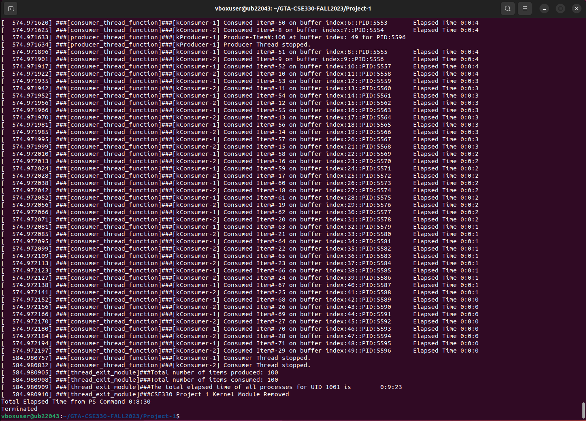

# CSE330: Operating Systems 

Please follow the below steps to test your Project-1 Process Management. (Due: **17th October 2023 11:59 PM**)

- Download the zip of this git repository.
- Unzip the repository.
- Implement your kernel module code in the template (producer\_consumer.c).
- Run the test.sh script with the test arguments. 

bash test.sh < Number of processes to be spawned> < Buffer Size > < Number of Producer > < Number of Consumer > < Number of lines to be displayed from the dmesg >

## Test Cases:

| Test Case #   | Test Command  | Test Criteria  | Total Points |
| :------------- |:-------------:| :-----:|:-----:|
| 1     | sudo ./test.sh 10 5 1 0 25  | The number of items produced will be equal to the buffer size 5. (3 pts)    Module should exit without error. (2 pts) | 5|
| 2     | sudo ./test.sh 10 5 0 1 25  | Consumer should consume nothing (2 pts)   Module should exit without error (3 pts) | 5|
| 3     | sudo ./test.sh 10 50 1 1 25 | The total number of produced items should be equal to 10. Each process should be produced and consumed only once. (4 pts)   CPU time should match with ps command. (4 pts)   Module should exit without error. (2 pts) | 10 |
| 4     | sudo ./test.sh 100 50 1 1 25 | The total number of produced items should be equal to 100. Each process should be produced and consumed only once. (6 pts)   CPU time should match with ps command. (6 pts)  Module should exit without error. (3 pts) | 15 |
| 5     | sudo ./test.sh 1000 50 1 1 100 | The total number of produced items should be equal to 1000. Each process should be produced and consumed only once. (6 pts).   CPU time should match with ps command. (6 pts)   Module should exit without error. (3 pts) | 15 |

## Bonus Points (Total Points:10)
  
a) Bonus Test Case:
  - If your code also passes the Bonus Test Case

| Test Case #   | Test Command  | Test Criteria  | Total Points |
| :------------- |:-------------:| :-----:|:-----:|
| 6     | sudo ./test.sh 100 50 1 2 25 | The toal CPU time calculated by 2 consumer thread should match with ps command. Module should exit without error  | 10 |

## Note: 
- Please do not make any changes in provided test code to pass the test cases.
- You can use print statements in case you want to debug and understand the logic of the test code.
- Please get in touch with the TAs if you face issues in using the test scripts.

## Sample Output Screenshots:

### Test Case 1

### Test Case 2

### Test Case 3

### Test Case 4

### Test Case 5

### Test Case 6

